# Car Resale Web App

A simple Laravel-based web application that allows individual users to register, post car listings, and browse cars with advanced filters. Built as a diploma project to solve real-world issues faced by users trying to sell cars on general-purpose platforms like Facebook Marketplace.

---

## Features

- User Registration & Login (Authentication)
- Post, Edit, and Delete Car Listings
- Upload and manage car images
- Advanced Search & Filter (make, model, year, price, etc.)
- Add to Favorites (Watchlist)
- User profile and listing management
- Responsive, clean UI using Blade templates

---

## Tech Stack

- **Backend:** PHP (Laravel Framework)
- **Frontend:** HTML5, CSS3, Blade Templates
- **Database:** MariaDB
- **Web Server:** Apache (XAMPP)
- **Testing:** PestPHP, Laravel Artisan Test
- **Tools:** Git, StarUML (for diagrams), VSCode

---

## Getting Started

### 1. Clone the repository

git clone https://github.com/yourusername/car-resale-web-app.git  
cd car-resale-web-app

### 2. Install dependencies
composer install  
npm install && npm run build

### 3. Configure environment
cp .env.example .env  
php artisan key:generate

- Update .env with your database credentials.

### 4. Migrate and seed the database
php artisan migrate --seed

### 5. Serve the app
php artisan serve

### 6. Running Tests
php artisan test

---

## Screenshots

### Home Page

- **Main View**  
  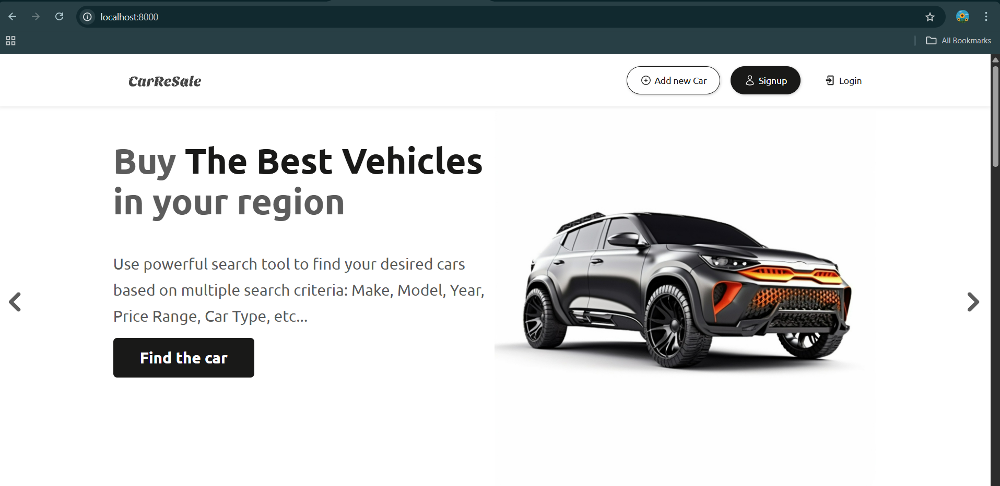

- **Search Section**  
  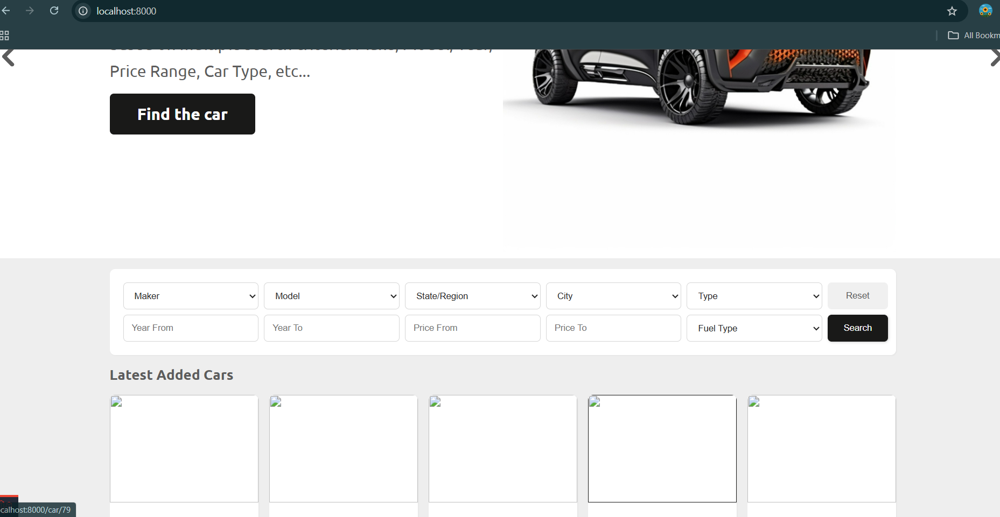

- **Car Listings**  
  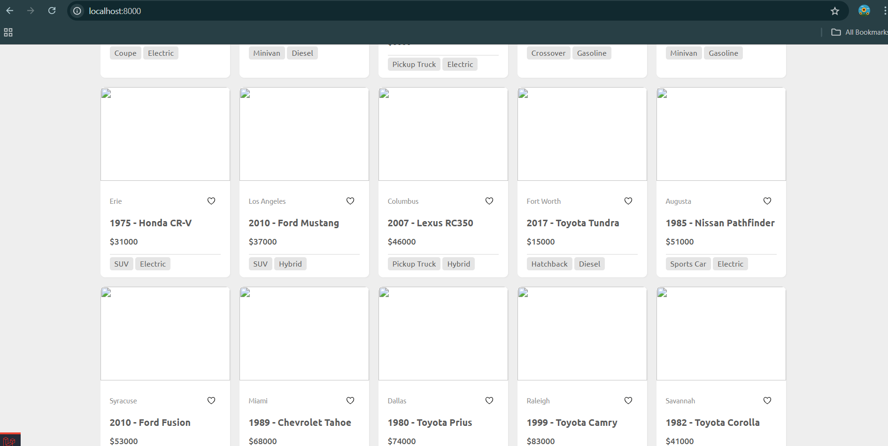

---

### Search Filter

- **Search Filter – View 1**  
  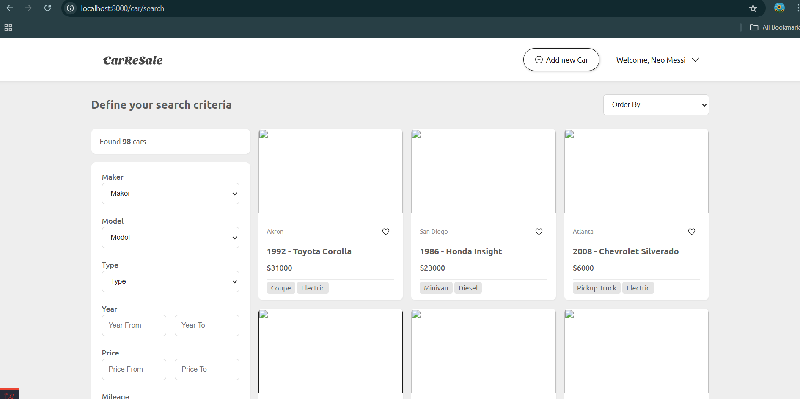

- **Search Filter – View 2**  
  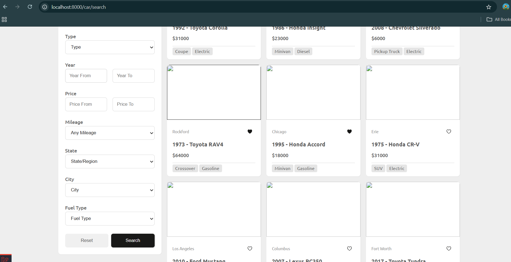

---

### Authenticated User Views

#### Car Listing Form

- **Form Overview**  
  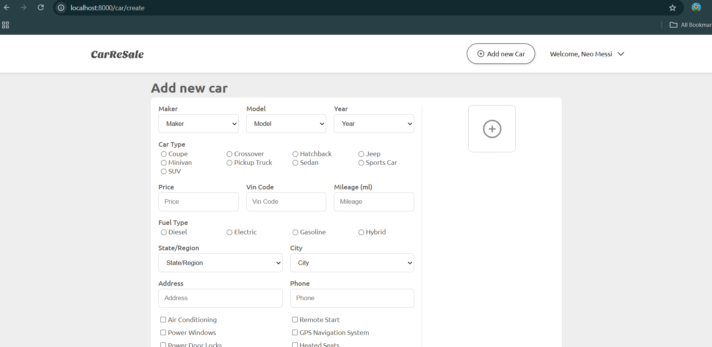

- **Validation & Upload Section**  
  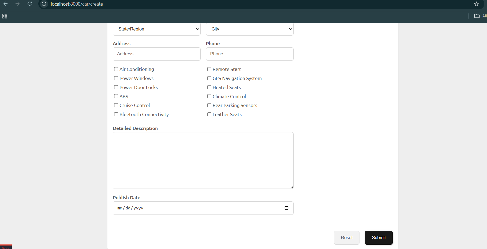

---

#### Profile Page

- **Profile Info View**  
  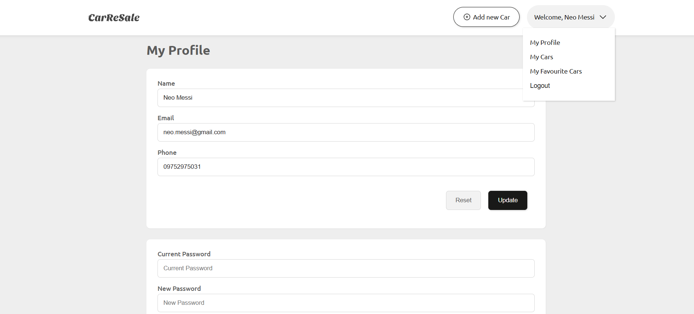

- **Update Profile Form**  
  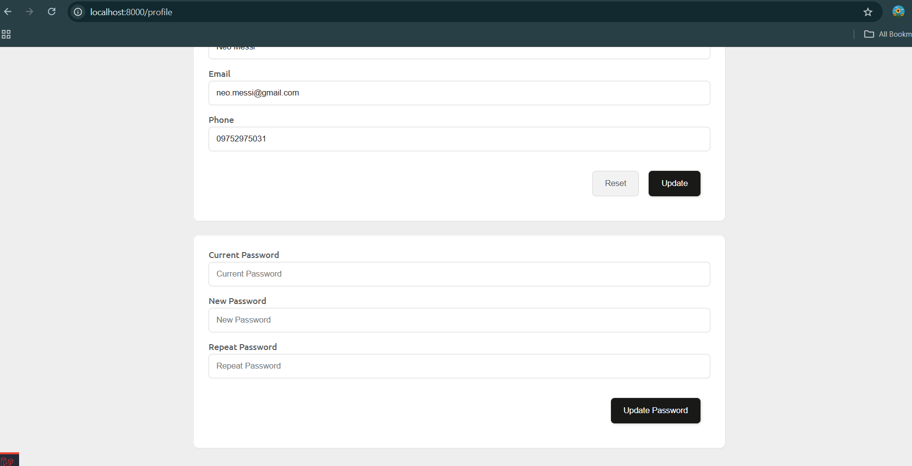

---

#### My Cars

This section allows users to:
- View all cars they have posted  
- Edit or delete any of their listings  
- Manage car images

- **List of Posted Cars**  
  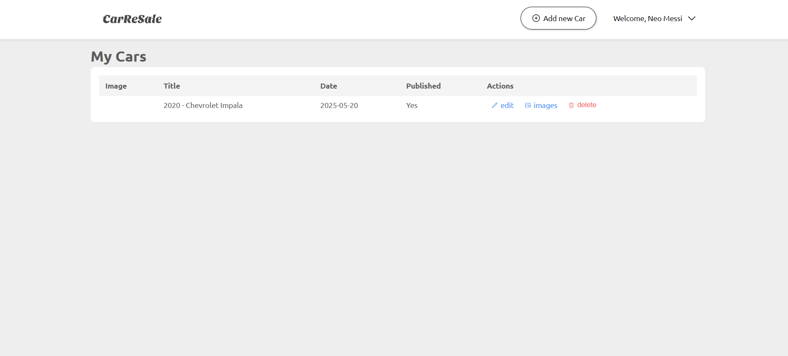

- **Edit Car Listing – View 1**  
  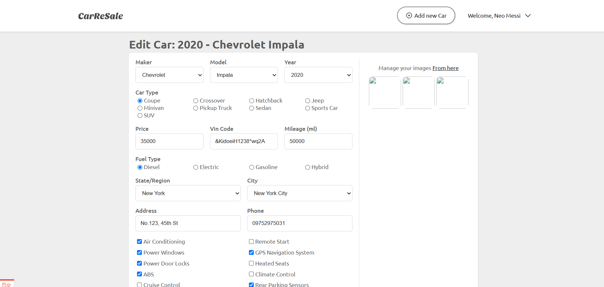

- **Edit Car Listing – View 2**  
  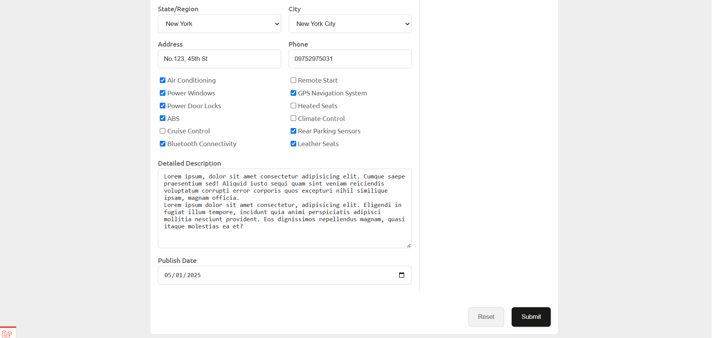

- **Manage Car Images**  
  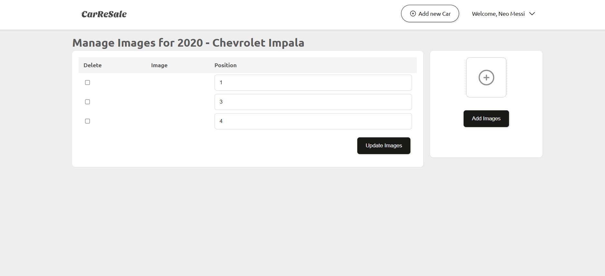

---

#### My Favorite Cars

Users can save cars to their watchlist and revisit them here.

- **Favorite Cars List**  
  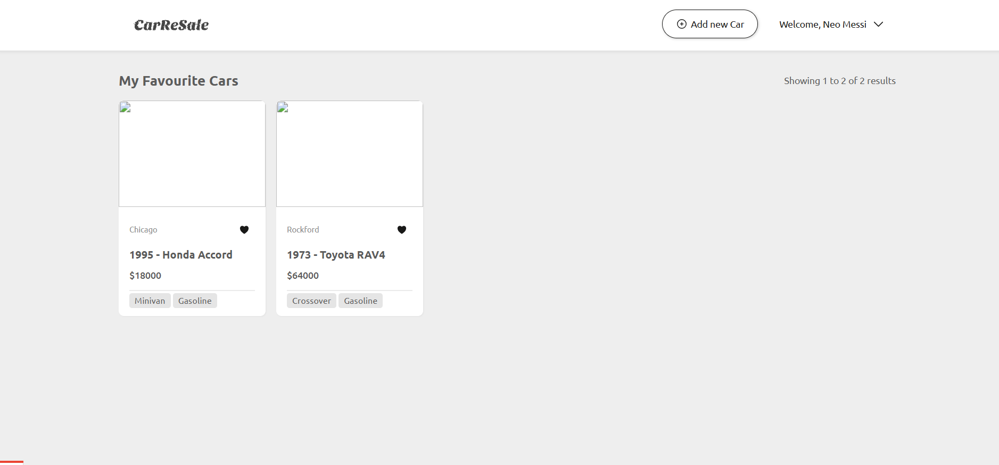

- **Remove from Favorites**  
  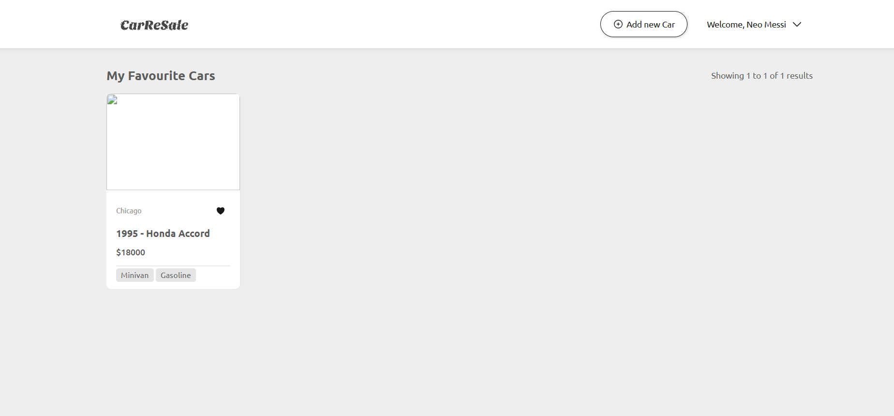

---

## License
This project is for academic and portfolio purposes.
Feel free to explore, learn, and adapt for non-commercial use.

---

## About the Developer
Built by Pone Nya Soe Nyunt, a junior PHP developer and diploma graduate.
Passionate about building clean, functional web apps with Laravel.